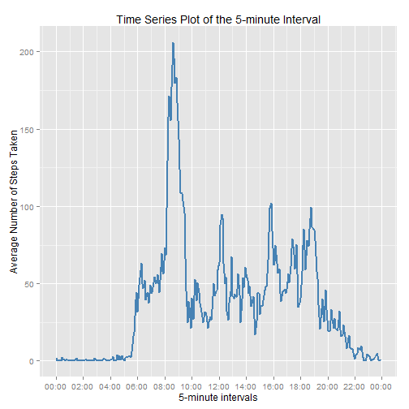

## Before starting
This homework is over-commented, but it helps me a lot: a lot of functions and procedures are described in detail, so when I'll come back to this paper I know what I did.

Have fun!

## PART 0: SETTING UP
I added a "part 0" where I can load up stuff like packages and setting up some global parameters.
**scales** package is needed to plot time-series.

```r
library(ggplot2)
require(scales)
echo = TRUE
Sys.setenv(LANG = "en")
Sys.setlocale("LC_TIME", "English")
```

```
## [1] "English_United States.1252"
```

## PART 1: LOADING DATA
### Requirements:
Show any code that is needed to:

1. Load the data (i.e. read.csv())

2. Process/transform the data (if necessary) into a format suitable for your analysis

### How:
Assuming that data are already downloaded, I just need to read them. Before of that, just have a look what is inside your current Working directory

```r
getwd()
```

```
## [1] "C:/R/Reproducible_Research/RepData_PeerAssessment1"
```

```r
list.files()
```

```
##  [1] "activity.csv"               "activity.zip"              
##  [3] "doc"                        "figure"                    
##  [5] "instructions_fig"           "PA1_template - Copia.Rmd"  
##  [7] "PA1_template.html"          "PA1_template.Rmd"          
##  [9] "PA1_template_files"         "plot1_totalsteps.png"      
## [11] "plot2_timeserie.png"        "plot3_totalstepsFilled.png"
## [13] "plot4_activityDiff.png"     "README.html"               
## [15] "README.md"                  "README.Rmd"                
## [17] "RepData_PA1 - Copia.Rmd"    "RepData_PA1.html"
```

To be sure and to take the habit, I directly check the presence of the file with the following chunk (you probably don't see any output because the file is present)

```r
if(!file.exists("activity.csv"))
{
    print("The file is not present, so I am going to download it")
    url <- "https://d396qusza40orc.cloudfront.net/repdata%2Fdata%2Factivity.zip"
    download.file(url, destfile = "./activity.zip")
    unzip("./activity.zip")    
}
```

Now, we can load the data (a simple .csv database) into *data* variable, 

```r
data <- read.csv("./activity.csv")
```

and have a look at it,

```r
head(data)
```

```
##   steps       date interval
## 1    NA 2012-10-01        0
## 2    NA 2012-10-01        5
## 3    NA 2012-10-01       10
## 4    NA 2012-10-01       15
## 5    NA 2012-10-01       20
## 6    NA 2012-10-01       25
```

```r
dim(data)
```

```
## [1] 17568     3
```

```r
str(data)
```

```
## 'data.frame':	17568 obs. of  3 variables:
##  $ steps   : int  NA NA NA NA NA NA NA NA NA NA ...
##  $ date    : Factor w/ 61 levels "2012-10-01","2012-10-02",..: 1 1 1 1 1 1 1 1 1 1 ...
##  $ interval: int  0 5 10 15 20 25 30 35 40 45 ...
```

expecially at the columns' class

```r
sapply(data, class)
```

```
##     steps      date  interval 
## "integer"  "factor" "integer"
```

As you can see, second column is problematic, because it is a *factor* variable, not a *date* variable. For this reason, I convert it

```r
data[,2] <- as.Date(data[,2])
head(data)
```

```
##   steps       date interval
## 1    NA 2012-10-01        0
## 2    NA 2012-10-01        5
## 3    NA 2012-10-01       10
## 4    NA 2012-10-01       15
## 5    NA 2012-10-01       20
## 6    NA 2012-10-01       25
```

and taking a new look at *data*, we can see that now the class is correct:

```r
sapply(data, class)
```

```
##     steps      date  interval 
## "integer"    "Date" "integer"
```

For the first plot, I also create a new variable *month*, just with *%m* and convert to numeric.
Here there are many commands, just to take confidence with them. At start, *month* is number (character, not numeric), then I convert it to a string with the proper month's name.
I must reorder the levels in *data$month* variable: if not, November is plotted before October because of alphabetical standard-ordering.

```r
data$month <- (format(data$date, "%m"))
class(data$month)
```

```
## [1] "character"
```

```r
head(data$month)
```

```
## [1] "10" "10" "10" "10" "10" "10"
```

```r
tail(data$month)
```

```
## [1] "11" "11" "11" "11" "11" "11"
```

```r
data$month <- gsub("10", "October", data$month)
data$month <- gsub("11", "November", data$month)
# Reordering
data$month <- factor(data$month, levels = c("October", "November"))
head(data$month)
```

```
## [1] October October October October October October
## Levels: October November
```

```r
tail(data$month)
```

```
## [1] November November November November November November
## Levels: October November
```
 
## PART 1: WHAT IS MEAN TOTAL NUMBER OF STEPS TAKEN PER DAY?
### Requirements: 
For this part of the assignment, you can ignore the missing values in the dataset.

1. Calculate the total number of steps taken per day

2. If you do not understand the difference between a histogram and a barplot, research the difference between them. Make a histogram of the total number of steps taken each day

3. Calculate and report the mean and median of the total number of steps taken per day
### How: 
#### 1. Calculate the total number of steps taken per day

I want to check how many different levels are present in *date* variable, and I expect that they will be 61, because the experiment is taken in October (31 days) and November (30 days)

```r
length(unique(data$date))
```

```
## [1] 61
```

OK! I can now calculate the steps per day. Before doing that, I first remove *NA* from my *data$steps* using two different strategies.
Standard one is to subset using **is.na** function:

```r
head(data[!is.na(data$steps), ])
```

```
##     steps       date interval   month
## 289     0 2012-10-02        0 October
## 290     0 2012-10-02        5 October
## 291     0 2012-10-02       10 October
## 292     0 2012-10-02       15 October
## 293     0 2012-10-02       20 October
## 294     0 2012-10-02       25 October
```

Second method uses a function that I just discovered, **na.omit**:

```r
head(na.omit(data))
```

```
##     steps       date interval   month
## 289     0 2012-10-02        0 October
## 290     0 2012-10-02        5 October
## 291     0 2012-10-02       10 October
## 292     0 2012-10-02       15 October
## 293     0 2012-10-02       20 October
## 294     0 2012-10-02       25 October
```

Both methods are good, I prefer the new one!

```r
noNAdata <- na.omit(data)
```

Using **aggregate**, I can subset *noNAdata* for different levels of *date* (possible because it is a factor variable), and summing these sub-groups with *FUN=sum*.
The first 6 elements are the first 6 days: 1st column is the day, the 2nd is the total number of steps taken each day. I can rename the column with **names** (see PART 2 for a different method).

```r
totalSteps <- aggregate(noNAdata$steps, list(noNAdata$date), FUN=sum)
names(totalSteps) <- c("day", "total_steps")
head(totalSteps)
```

```
##          day total_steps
## 1 2012-10-02         126
## 2 2012-10-03       11352
## 3 2012-10-04       12116
## 4 2012-10-05       13294
## 5 2012-10-06       15420
## 6 2012-10-07       11015
```

Now *totalSteps* contains the global number of steps done during each day in October and November, and you can see a plot of this variable in the next point.

#### 2. If you do not understand the difference between a histogram and a barplot, research the difference between them. Make a histogram of the total number of steps taken each day

I decided to use **ggplot2** because it is more versatile and it has more funny options.
I dont need to plot *totalSteps* because *stat* in **geom_bar(stat = "identity", ...)** takes count of VALUES, not COUNTS (using stat="bin", R try to create a preset, grouping and creating bins).

```r
png(filename = "./plot1_totalsteps.png")
# These 2 plots are identical, I just wanted to save a copy .png into Working Directory. This is my only way to achieve that result

ggplot(noNAdata, aes(date, steps)) + 
    geom_bar(stat = "identity", colour = "darkslategray3", fill = "darkslategray3", width = 0.7) + 
    facet_grid(. ~ month, scales = "free") + 
    labs(title = "Histogram of Total Number of Steps taken each day", x = "Date", y = "Total number of steps")
dev.off()
```

```
## png 
##   2
```

```r
ggplot(noNAdata, aes(date, steps)) + 
    geom_bar(stat = "identity", colour = "darkslategray3", fill = "darkslategray3", width = 0.7) + 
    facet_grid(. ~ month, scales = "free") + 
    labs(title = "Histogram of Total Number of Steps Taken Each Day", x = "Date", y = "Total number of steps")
```

 

#### 3. Calculate and report the mean and median of the total number of steps taken per day
This step is performed just with 2 simple function:
mean of steps per day

```r
mean(totalSteps$total_steps)
```

```
## [1] 10766.19
```

and

```r
median(totalSteps$total_steps)
```

```
## [1] 10765
```
This conclude the first part of the Peer Assessment.

## PART 2: WHAT IS THE AVERAGE DAILY ACTIVITY PATTERN?
### Requirements: 

1. Make a time series plot (i.e. type = "l") of the 5-minute interval (x-axis) and the average number of steps taken, averaged across all days (y-axis)

2. Which 5-minute interval, on average across all the days in the dataset, contains the maximum number of steps?

### How:
#### 1. Make a time series plot (i.e. type = "l") of the 5-minute interval (x-axis) and the average number of steps taken, averaged across all days (y-axis) 

In the x-axis the variable is the time-interval and in the y-axis it is the averaged number of steps per interval across all days with no NA value (53): infact we have the same number of counts for each time interval

```r
head(table(noNAdata$interval))
```

```
## 
##  0  5 10 15 20 25 
## 53 53 53 53 53 53
```

Next chunk is to convert numeric and character variables *interval* and *date* into a proper date class, to be correctly plotted as time-series.
Initially, I format *interval* (that is numeric) as a four digit number, filling with zeros.
Then, a problem arise: interval "0" is not converted to "0000", so I subset "0" and replacing with the correct time-stamp, using **gsub**.
Again with **gsub**, I insert a colon ":" in the middle, and then I convert them as character, pasting them two together into *noNAdata$global* variable.
Last step is converting it to POSIXct class.
NOTE: I prefer to keep also *interval* column, just to have a direct comparison with *interval2*.

```r
noNAdata$interval2 <- formatC(noNAdata$interval, digits=3, format="fg", flag="0")
noNAdata$interval2 <- gsub("^0$", "0000", noNAdata$interval2)
noNAdata$interval2 <- gsub("([[:digit:]]{2,2})$", ":\\1", noNAdata$interval2)
noNAdata$date <- as.character(noNAdata$date)
noNAdata$global <- paste(noNAdata$date, noNAdata$interval2)
noNAdata$global <- as.POSIXct(strptime(noNAdata$global, "%Y-%m-%d %H:%M", tz='GMT'))
class(noNAdata$global)
```

```
## [1] "POSIXct" "POSIXt"
```

```r
head(noNAdata)
```

```
##     steps       date interval   month interval2              global
## 289     0 2012-10-02        0 October     00:00 2012-10-02 00:00:00
## 290     0 2012-10-02        5 October     00:05 2012-10-02 00:05:00
## 291     0 2012-10-02       10 October     00:10 2012-10-02 00:10:00
## 292     0 2012-10-02       15 October     00:15 2012-10-02 00:15:00
## 293     0 2012-10-02       20 October     00:20 2012-10-02 00:20:00
## 294     0 2012-10-02       25 October     00:25 2012-10-02 00:25:00
```

I use **aggregate** again, but this time I subset *noNAdata* by *noNA$interval2* variable and average with *FUN=mean*. I also changed *interval* class to POSIXct,so I can use **scale_x_datetime** inside ggplot, really usefull when dealing with time-series. 

```r
intervalSteps <- aggregate(noNAdata$steps, list(interval=noNAdata$interval2), FUN=mean)
names(intervalSteps)[2] <- "averageSteps"
intervalSteps$interval <- as.POSIXct(strptime(intervalSteps$interval, "%H:%M"))
head(intervalSteps)
```

```
##              interval averageSteps
## 1 2015-03-11 00:00:00    1.7169811
## 2 2015-03-11 00:05:00    0.3396226
## 3 2015-03-11 00:10:00    0.1320755
## 4 2015-03-11 00:15:00    0.1509434
## 5 2015-03-11 00:20:00    0.0754717
## 6 2015-03-11 00:25:00    2.0943396
```

```r
png(filename = "./plot2_timeserie.png")
# These 2 plots are identical, I just wanted to save a copy .png into Working Directory. This is my only way to achieve that result
ggplot(intervalSteps, aes(interval, averageSteps)) + 
        geom_line(color = "steelblue", size = 0.8) + 
        labs(title = "Time Series Plot of the 5-minute Interval", x = "5-minute intervals", y = "Average Number of Steps Taken") +
        scale_x_datetime(breaks = date_breaks(width = "2 hour"), labels = date_format("%H:%M"))
dev.off()
```

```
## png 
##   2
```

```r
ggplot(intervalSteps, aes(interval, averageSteps)) + 
        geom_line(color = "steelblue", size = 0.8) + 
        labs(title = "Time Series Plot of the 5-minute Interval", x = "5-minute intervals", y = "Average Number of Steps Taken") +
        scale_x_datetime(breaks = date_breaks(width = "2 hour"), labels = date_format("%H:%M"))
```

 

#### 2. Which 5-minute interval, on average across all the days in the dataset, contains the maximum number of steps?
Using **which.max** I find the max inside *averageSteps*: with this information, I subset the dataset with that row-index and in this way I can also see what is the position, the interval-date, and its value.

```r
intervalSteps[which.max(intervalSteps$averageSteps), ]
```

```
##                interval averageSteps
## 104 2015-03-11 08:35:00     206.1698
```

## PART 2: Imputing missing values?
### Requirements:
1. Calculate and report the total number of missing values in the dataset (i.e. the total number of rows with NAs)

2. Devise a strategy for filling in all of the missing values in the dataset. The strategy does not need to be sophisticated. For example, you could use the mean/median for that day, or the mean for that 5-minute interval, etc.

3. Create a new dataset that is equal to the original dataset but with the missing data filled in.

4. Make a histogram of the total number of steps taken each day and Calculate and report the mean and median total number of steps taken per day. Do these values differ from the estimates from the first part of the assignment? What is the impact of imputing missing data on the estimates of the total daily number of steps?

### How:
#### 1. Calculate and report the total number of missing values in the dataset (i.e. the total number of rows with NAs)
Using **complete.cases** function, I can table the rows that are not complete because they have NA values.

```r
table(!complete.cases(data))
```

```
## 
## FALSE  TRUE 
## 15264  2304
```

#### 2. Devise a strategy for filling in all of the missing values in the dataset. The strategy does not need to be sophisticated. For example, you could use the mean/median for that day, or the mean for that 5-minute interval, etc.

My strategy is to substitute the missing value with the proper value taken that is the mean for that interval across all days.

#### 3. Create a new dataset that is equal to the original dataset but with the missing data filled in.
I decided to use the periodicity of the **intervalSteps** data.frame: it has 288 rows, that are the total intervals of 5minutes in a day. Then I use this information, taking the corresponding row in this data.frame by a simple division ( /288 - number intervals in a day) and substituing NA value with the mean across all 61 days in *that* particular interval.


```r
dataFilled <- data
for (i in 1:nrow(dataFilled)){
        if (is.na(dataFilled$steps[i])) {
            if((i %% 288) == 0){dataFilled$steps[i] <- intervalSteps[1,2]}
            else{dataFilled$steps[i] <- intervalSteps[(i %% 288), 2]}
        }
    }
head(dataFilled)
```

```
##       steps       date interval   month
## 1 1.7169811 2012-10-01        0 October
## 2 0.3396226 2012-10-01        5 October
## 3 0.1320755 2012-10-01       10 October
## 4 0.1509434 2012-10-01       15 October
## 5 0.0754717 2012-10-01       20 October
## 6 2.0943396 2012-10-01       25 October
```

```r
tail(dataFilled)
```

```
##           steps       date interval    month
## 17563 2.6037736 2012-11-30     2330 November
## 17564 4.6981132 2012-11-30     2335 November
## 17565 3.3018868 2012-11-30     2340 November
## 17566 0.6415094 2012-11-30     2345 November
## 17567 0.2264151 2012-11-30     2350 November
## 17568 1.7169811 2012-11-30     2355 November
```

#### 4. Make a histogram of the total number of steps taken each day and Calculate and report the mean and median total number of steps taken per day.

Here the code to plot to a file (./plot1_totalstepsFilled.png) and to markdown the plot with the Filled data.

```r
png(filename = "./plot3_totalstepsFilled.png")
# These 2 plots are identical, I just wanted to save a copy .png into Working Directory. This is my only way to achieve that result

ggplot(dataFilled, aes(date, steps)) + 
    geom_bar(stat = "identity", colour = "darkslategray3", fill = "darkslategray3", width = 0.7) + 
    facet_grid(. ~ month, scales = "free") + 
    labs(title = "Histogram of Total Number of Steps taken each day", x = "Date", y = "Total number of steps")
dev.off()
```

```
## png 
##   2
```

```r
ggplot(dataFilled, aes(date, steps)) + 
    geom_bar(stat = "identity", colour = "firebrick1", fill = "firebrick1", width = 0.7) + 
    facet_grid(. ~ month, scales = "free") + 
    labs(title = "Histogram of Total Number of Steps Taken Each Day (no missing data)", x = "Date", y = "Total number of steps")
```

 

Mean and Median for this filled data.frame are calculated as before, using *aggregate* function to subset per day and applying SUM to each group.

```r
totalStepsFilled <- aggregate(dataFilled$steps, 
                           list(Date = dataFilled$date), 
                           FUN = "sum")$x
filledMean <- mean(totalStepsFilled)
filledMean
```

```
## [1] 10766.27
```

```r
filledMedian <- median(totalStepsFilled)
filledMedian
```

```
## [1] 10766.83
```

Now i compare the new values (dataFilled) with old one data.frame, where NA were present.

```r
NAmean <- mean(totalSteps$total_steps)
NAmedian <- median(totalSteps$total_steps)
filledMean - NAmean
```

```
## [1] 0.08413238
```

```r
filledMedian - NAmedian
```

```
## [1] 1.830189
```

It is clearly shown that imputing missing values has changed some global property of the distribution: even if mean is the same, median is now greater than before.

## PART 3: Are there differences in activity patterns between weekdays and weekends?
### Requirements:
1. Create a new factor variable in the dataset with two levels - "weekday" and "weekend" indicating whether a given date is a weekday or weekend day.

2. Make a panel plot containing a time series plot (i.e. type = "l") of the 5-minute interval (x-axis) and the average number of steps taken, averaged across all weekday days or weekend days (y-axis). See the README file in the GitHub repository to see an example of what this plot should look like using simulated data.

### How:
#### 1. Create a new factor variable in the dataset with two levels - "weekday" and "weekend" indicating whether a given date is a weekday or weekend day.
In the same way as before, I added 2 new columns "global" and "days", indicating the data and the day of the week corresponding at each row.

```r
dataFilled$interval2 <- formatC(dataFilled$interval, digits=3, format="fg", flag="0")
dataFilled$interval2 <- gsub("^0$", "0000", dataFilled$interval2)
dataFilled$interval2 <- gsub("([[:digit:]]{2,2})$", ":\\1", dataFilled$interval2)
dataFilled$date <- as.character(dataFilled$date)
dataFilled$global <- paste(dataFilled$date, dataFilled$interval2)
dataFilled$global <- as.POSIXct(strptime(dataFilled$global, "%Y-%m-%d %H:%M", tz='GMT'))
dataFilled$days <- as.factor(weekdays(dataFilled$global))
levels(dataFilled$days)
```

```
## [1] "Friday"    "Monday"    "Saturday"  "Sunday"    "Thursday"  "Tuesday"  
## [7] "Wednesday"
```

```r
head(dataFilled)
```

```
##       steps       date interval   month interval2              global
## 1 1.7169811 2012-10-01        0 October     00:00 2012-10-01 00:00:00
## 2 0.3396226 2012-10-01        5 October     00:05 2012-10-01 00:05:00
## 3 0.1320755 2012-10-01       10 October     00:10 2012-10-01 00:10:00
## 4 0.1509434 2012-10-01       15 October     00:15 2012-10-01 00:15:00
## 5 0.0754717 2012-10-01       20 October     00:20 2012-10-01 00:20:00
## 6 2.0943396 2012-10-01       25 October     00:25 2012-10-01 00:25:00
##     days
## 1 Monday
## 2 Monday
## 3 Monday
## 4 Monday
## 5 Monday
## 6 Monday
```


#### 2. Make a panel plot containing a time series plot (i.e. type = "l") of the 5-minute interval (x-axis) and the average number of steps taken, averaged across all weekday days or weekend days (y-axis). See the README file in the GitHub repository to see an example of what this plot should look like using simulated data. 
Using **weekdays**, I can create directly from the date variable *global* the list of different days in the week. Then, I put them together in the factor variable *days* creating 2 different levels, *weekday* and *weekend*.

```r
levels(dataFilled$days) <- list(weekday=c("Monday", "Thursday", "Wednesday", "Tuesday", "Friday"), weekend=c("Saturday", "Sunday"))
levels(dataFilled$days)
```

```
## [1] "weekday" "weekend"
```

```r
head(dataFilled)
```

```
##       steps       date interval   month interval2              global
## 1 1.7169811 2012-10-01        0 October     00:00 2012-10-01 00:00:00
## 2 0.3396226 2012-10-01        5 October     00:05 2012-10-01 00:05:00
## 3 0.1320755 2012-10-01       10 October     00:10 2012-10-01 00:10:00
## 4 0.1509434 2012-10-01       15 October     00:15 2012-10-01 00:15:00
## 5 0.0754717 2012-10-01       20 October     00:20 2012-10-01 00:20:00
## 6 2.0943396 2012-10-01       25 October     00:25 2012-10-01 00:25:00
##      days
## 1 weekday
## 2 weekday
## 3 weekday
## 4 weekday
## 5 weekday
## 6 weekday
```

I use **aggregate** again to subset the filled data.frame by *interval2* and calculating the mean value across all weekdays or weekend. 

```r
intervalStepsFilled <- aggregate(dataFilled$steps,
                                 list(interval=dataFilled$interval2, weekdays=dataFilled$days),
                                 FUN="mean")
names(intervalStepsFilled)[3] <- "averageSteps"
intervalStepsFilled$interval <- as.POSIXct(strptime(intervalStepsFilled$interval, "%H:%M"))
head(intervalStepsFilled)
```

```
##              interval weekdays averageSteps
## 1 2015-03-11 00:00:00  weekday   2.25115304
## 2 2015-03-11 00:05:00  weekday   0.44528302
## 3 2015-03-11 00:10:00  weekday   0.17316562
## 4 2015-03-11 00:15:00  weekday   0.19790356
## 5 2015-03-11 00:20:00  weekday   0.09895178
## 6 2015-03-11 00:25:00  weekday   1.59035639
```

```r
names(intervalStepsFilled)
```

```
## [1] "interval"     "weekdays"     "averageSteps"
```

I can now produce the plot requested using ggplot2. I have faceted by weekend and weekdays as requested.

```r
png(filename = "./plot4_activityDiff.png")
# These 2 plots are identical, I just wanted to save a copy .png into Working Directory. This is my only way to achieve that result
ggplot(intervalStepsFilled, aes(interval, averageSteps)) + 
    geom_line(color = "deeppink", size = 0.8) + 
    labs(title = "Activity differences between weekdays and weekends", x = "5-minute intervals", y = "Average Number of Steps") +
    scale_x_datetime(breaks = date_breaks(width = "2 hour"), labels = date_format("%H:%M")) +
    facet_wrap(~ weekdays, nrow=2, ncol=1)
dev.off()
```

```
## png 
##   2
```

```r
ggplot(intervalStepsFilled, aes(interval, averageSteps)) + 
    geom_line(color = "deeppink", size = 0.8) + 
    labs(title = "Activity differences between weekdays and weekends", x = "5-minute intervals", y = "Average Number of Steps") +
    scale_x_datetime(breaks = date_breaks(width = "2 hour"), labels = date_format("%H:%M")) +
    facet_wrap(~ weekdays, nrow=2, ncol=1)
```

 
